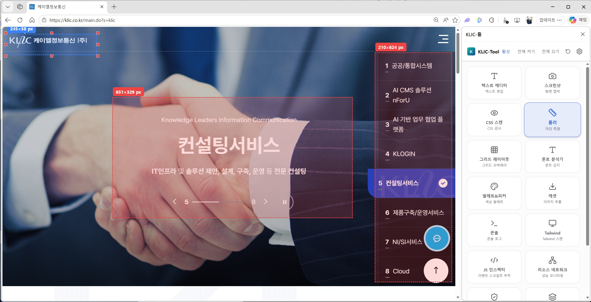
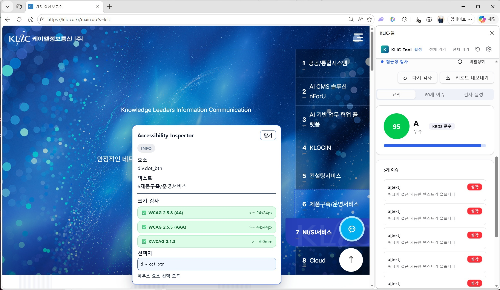

<div align="center">

# KLIC-Tool

**Chrome Extension for Frontend Developers**

프론트엔드 개발자를 위한 올인원 웹 개발 도구 — 14가지 도구를 사이드 패널에서 바로 사용하세요.

[](https://developer.chrome.com/docs/extensions/)
[](https://react.dev/)
[](https://www.typescriptlang.org/)
[](https://vite.dev/)
[](https://tailwindcss.com/)

</div>

---

<p align="center">
  
</p>

---

## Features

<div align="center">
  
  
</div>

### 14 Built-in Tools

| Category | Tool | Description |
|----------|------|-------------|
| 📸 Capture | Screenshot | 요소별 스크린샷 캡처, 전체 페이지 캡처, GIF 녹화 |
| ✏️ Edit | Text Editor | 텍스트 직접 편집 |
| 🔍 Analyze | CSS Scan | CSS 속성 검사 및 복사 |
| 🌊 Analyze | Tailwind | Tailwind 클래스 스캔 및 변환 |
| 🔤 Analyze | Font Analyzer | 폰트 감지 및 분석 |
| 🎨 Analyze | Palette | 색상 팔레트 추출 |
| 🔬 Analyze | JS Inspector | Chrome Debugger 기반 스크립트 검사 |
| ♿ Analyze | Accessibility Checker | KRDS 웹 접근성 검사 (WCAG 2.1 AA) |
| 🧩 Analyze | Component Inspector | React/프레임워크 컴포넌트 감지 |
| 📏 Measure | Ruler | 거리 측정 |
| 📐 Measure | Grid Layout | 그리드 오버레이 |
| 🖼️ Utility | Assets | 이미지 추출 및 다운로드 |
| 💻 Utility | Console | 콘솔 로그 모니터링 |
| 📊 Utility | Resource Network | 성능 모니터링 |

### Highlights

- **Light / Dark / System** 테마 지원 + 5가지 액센트 컬러 (Blue, Amber, Green, Violet, Rose)
- **한국어 / English** 다국어 지원
- **커스텀 키보드 단축키** — 설정에서 자유롭게 지정 및 Import/Export
- **Manifest V3** — 최신 Chrome Extension 표준

## Installation

```bash
git clone git@github.com:klic-co-kr/KLIC-FrontScope.git
cd KLIC-FrontScope
npm install
npm run build
```

**Chrome에 로드:**
1. `chrome://extensions/` 접속
2. 개발자 모드 활성화
3. "압축해제된 확장 프로그램을 로드합니다" → `dist/` 폴더 선택

## Development

```bash
npm run dev          # Vite dev server with HMR
npm run build        # tsc -b && vite build
npm run lint         # ESLint
tsc -b               # Type checking only
npm run i18n:check   # Verify translation keys are synced
npm run test:e2e     # Playwright E2E tests
```

코드 변경 후: `npm run build` → 확장 프로그램 카드에서 새로고침 아이콘 클릭

## Keyboard Shortcuts

| Tool | Default Shortcut |
|------|-----------------|
| Text Editor | `Ctrl+Shift+E` |
| Screenshot | `Ctrl+Shift+S` |
| CSS Scan | `Ctrl+Shift+I` |
| Ruler | `Ctrl+Shift+R` |
| Grid Layout | `Ctrl+Shift+G` |
| Accessibility Checker | `Ctrl+Shift+A` |

Settings > Shortcuts에서 커스텀 단축키 녹화, 중복 검증, Import/Export 가능

## Internationalization (i18n)

한국어(ko) / English(en) 지원

```tsx
import { useTranslation } from 'react-i18next';

function MyComponent() {
  const { t } = useTranslation();
  return <button>{t('common.save')}</button>;
}
```

번역 키 추가 시:
```bash
npm run i18n:generate   # 키 자동 추출
npm run i18n:check      # ko/en 동기화 검증
```

## Tech Stack

| Layer | Technology |
|-------|-----------|
| UI | React 19, shadcn/ui, Radix UI |
| Language | TypeScript 6 |
| Build | Vite 8 (Rolldown) |
| Styling | Tailwind CSS 4 |
| i18n | react-i18next |
| Extension | Chrome Extension Manifest V3 |

## Project Structure

```
src/
├── background/          # Service worker (privileged Chrome APIs)
├── components/          # UI components (shadcn/ui + tool panels)
├── content/             # Content scripts (injected into web pages)
├── i18n/locales/        # Translation files (ko.json, en.json)
├── offscreen/           # Offscreen document (GIF encoding)
├── sidepanel/           # Main side panel UI (App, ToolRouter, Settings)
├── constants/           # Message actions, storage keys
├── types/               # TypeScript type definitions
├── hooks/               # Custom React hooks
├── utils/               # Helper functions
└── lib/                 # Theme provider, utilities
```

## Architecture

```
┌─────────────┐     chrome.tabs.sendMessage     ┌──────────────────┐
│  Side Panel  │ ──────────────────────────────► │  Content Script  │
│  (React UI)  │ ◄────────────────────────────── │  (DOM Access)    │
└──────┬───────┘     TOOL_DATA / CONSOLE_LOG     └────────┬─────────┘
       │                                                 │
       │ chrome.runtime.connect                          │ chrome.runtime.sendMessage
       ▼                                                 ▼
┌──────────────┐                                  ┌──────────────┐
│  Background   │ ◄──── chrome.debugger ────────── │  JS Inspector │
│  (Service     │       chrome.tabs.captureVisible │              │
│   Worker)     │                                  └──────────────┘
└──────┬───────┘
       │ chrome.runtime.sendMessage
       ▼
┌──────────────┐
│   Offscreen   │  Canvas API for GIF encoding
│   Document    │
└──────────────┘
```

## License

MIT License © 2026 klic-co-kr

## Author

@acc0mplish
