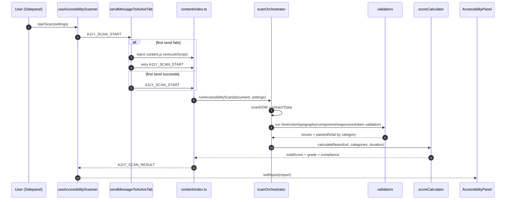
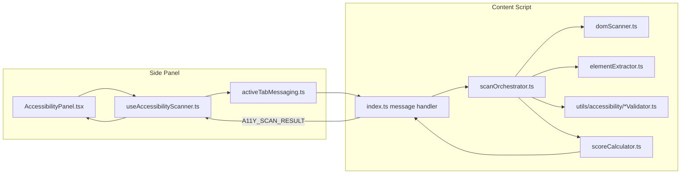

# Accessibility Checker 검사 동작 분석 (현재 코드 기준)

작성일: 2026-02-20  
대상 리포지토리: `KLIC-frontend`

이 문서는 "접근성 검사 기능이 실제로 어떻게 동작하는지"를 코드 기준으로 정리한 기술 문서다.  
핵심은 **실행 경로(트리거 -> 스캔 -> 검증 -> 점수화 -> UI 표시)**와 **WCAG/KRDS 근거 연결**이다.

---

## 1) 한눈에 보는 실행 흐름

1. 사이드패널에서 검사 시작 버튼 클릭
2. `useAccessibilityScanner.startScan()`이 활성 탭으로 `A11Y_SCAN_START` 전송
3. 콘텐츠 스크립트(`src/content/index.ts`)가 메시지를 받아 `runAccessibilityScan()` 실행
4. DOM 스캔 -> 카테고리별 validator 실행 -> `calculateReport()`로 통합 리포트 생성
5. 결과를 `A11Y_SCAN_RESULT`로 다시 런타임 메시지 전송 + `sendResponse`
6. 사이드패널이 리포트를 받아 `ScoreCard`, `IssueList`, `CategoryTabs`에 렌더링

실행 체인 주요 위치:
- 트리거/수신: `src/hooks/accessibility/useAccessibilityScanner.ts:35`, `src/content/index.ts:644`
- 오케스트레이션: `src/content/accessibility/scanOrchestrator.ts:19`
- 점수 계산: `src/utils/accessibility/scoreCalculator.ts:19`, `src/utils/accessibility/scoreCalculator.ts:65`
- UI 렌더링: `src/components/AccessibilityChecker/AccessibilityPanel.tsx:74`, `src/components/AccessibilityChecker/CategoryTabs.tsx:154`

### 1.1 Mermaid: 실행 시퀀스도



### 1.2 Mermaid: 구조도 (컴포넌트/모듈)



### 1.3 Mermaid: 점수 계산 흐름도

```mermaid
flowchart TD
    A[Category scan result\nchecks + issues] --> B[Category score\nround(passed/total * 100)]
    A --> C[Severity weighting\ncritical 10, high 5, medium 3, low 1, info 0]
    C --> D[maxPenalty = totalChecks * 10]
    C --> E[actualPenalty = sum(issue weights)]
    D --> F[totalScore = max(0, round((1 - actualPenalty/maxPenalty) * 100))]
    E --> F
    F --> G[grade: A/B/C/D/F]
    F --> H[KRDS compliant if totalScore >= 75]
```

---

## 2) 스캔 시작/메시징 상세

### 2.1 사이드패널에서 스캔 시작

- `startScan()`은 먼저 리스너를 등록해 `A11Y_SCAN_RESULT`를 기다린다.
- 이후 활성 탭으로 `A11Y_SCAN_START`를 보낸다.
- 경로: `src/hooks/accessibility/useAccessibilityScanner.ts:35`

### 2.2 "Receiving end does not exist" 대응 로직

- 메시지 전송은 `sendMessageToActiveTab()` 경유로 통일되어 있다.
- 이 함수는:
  - 현재 창의 활성 탭을 찾고,
  - 1차 `chrome.tabs.sendMessage` 시도,
  - 실패 시 `chrome.scripting.executeScript`로 `assets/content.js` 재주입,
  - 재시도한다.
- 경로: `src/hooks/resourceNetwork/activeTabMessaging.ts:32`

즉, 콘텐츠 스크립트 미주입 탭에서 발생하던 연결 오류를 주입 fallback으로 흡수한다.

### 2.3 콘텐츠 스크립트 수신

- `src/content/index.ts`의 메시지 핸들러에서 `A11Y_SCAN_START`를 처리한다.
- 성공 시:
  - `safeSendMessage({ action: 'A11Y_SCAN_RESULT', data: report })`
  - `sendResponse({ success: true, data: report })`
- 경로: `src/content/index.ts:644`

---

## 3) 스캔 파이프라인 (콘텐츠 스크립트 내부)

### 3.1 진입점

- `handleAccessibilityScan(settings)`에서 기본 설정을 병합하고
- `runAccessibilityScan(document, scanSettings)` 호출
- 경로: `src/content/index.ts:44`

### 3.2 DOM 스캔

- `scanDOM(root, maxElements, includeHidden)`
- BFS 큐 기반 순회, 중복 방지(`seen`), 최대 개수 제한
- KLIC 요소(`isKLICElement`) 제외
- `display:none`, `visibility:hidden`, `opacity:0`, `aria-hidden=true` 숨김 처리
- 경로: `src/content/accessibility/domScanner.ts:17`

### 3.3 데이터 추출

- `extractColorData`, `extractTypographyData`, `extractComponentData`, `extractTokenData`
- 경로: `src/content/accessibility/elementExtractor.ts`

주의:
- 추출 함수 일부는 "placeholder(issues 빈 배열)" 구조를 갖고, 실제 issue 생성은 오케스트레이터에서 validator를 직접 호출해 수행한다.
- 실제 issue 판단의 단일 진실 소스는 `src/utils/accessibility/*Validator.ts`들이다.

### 3.4 카테고리별 validator 실행

- 오케스트레이터가 설정(`enabledCategories`) 기준으로 validator를 호출한다.
- HTML은 현재 구현에서 항상 `categories.push(extractHtmlData(...))`가 수행된다.
- 경로: `src/content/accessibility/scanOrchestrator.ts:39`

### 3.5 리포트 계산

- `calculateReport(url, categories, scanDuration)`에서
  - 총점,
  - 등급,
  - 심각도 집계,
  - KRDS 준수 여부를 생성한다.
- 경로: `src/utils/accessibility/scoreCalculator.ts:65`

---

## 4) 카테고리별 검사 규칙 (실제 구현 기준)

아래는 "문서 계획"이 아니라 실제 validator 코드에 구현된 규칙만 정리한 내용이다.

### 4.1 HTML (`htmlValidator.ts`)

- `img[alt]` -> `critical`, WCAG `1.1.1`
- `input[label]` -> `critical`, WCAG `1.3.1`
- `a[text]` -> `critical`, WCAG `2.4.4`
- `button[text]` -> `critical`, WCAG `4.1.2`
- `table[th]` -> `high`, WCAG `1.3.1`
- `heading-order` -> `high`, WCAG `1.3.1`
- `html[lang]` -> `high`, WCAG `3.1.1`
- `landmark` -> `medium`, WCAG `2.4.1`
- 양수 `tabindex` 사용 -> `medium`, WCAG `2.4.3`

경로: `src/utils/accessibility/htmlValidator.ts:7`

### 4.2 Color (`colorValidator.ts`)

- 텍스트 대비율 검사(일반 4.5:1, 큰 텍스트 3:1) -> `critical`, WCAG `1.4.3`
- 색상만으로 정보 전달 가능성 휴리스틱 -> `medium`, WCAG `1.4.1`
- KRDS 팔레트 일치 여부 확인(권고) -> `info`

경로: `src/utils/accessibility/colorValidator.ts:13`

### 4.3 Typography (`typographyValidator.ts`)

- 최소 폰트 크기(본문 16px, 캡션 12px) -> `high`, WCAG `1.4.4`
- 최소 줄간격(본문 1.4, 헤딩 1.2) -> `high`, WCAG `1.4.8` (AAA 참고)
- 본문 음수 자간 -> `medium`
- KRDS 굵기/헤딩 스케일 불일치 -> `info`

경로: `src/utils/accessibility/typographyValidator.ts:11`

### 4.4 Component (`componentValidator.ts`)

- 버튼 최소 크기 44x44 -> `high`, KRDS `button-min-size`
- 폼 레이블 연결 -> `critical`, KRDS `form-label`
- 모달 닫기 버튼/`aria-modal` 점검 -> `high`, KRDS `modal-escape`, `modal-focus-trap`
- 라디오 fieldset 그룹화 -> `medium`, KRDS `form-fieldset`
- 아코디언 ARIA/키보드 접근성 점검 -> `high/medium`, KRDS `accordion-keyboard`
- 알림 영역 `aria-live`, `aria-atomic` 점검 -> `medium/info`, KRDS `error-handling`
- 포커스 스타일 제거 규칙 점검 -> `medium`, WCAG `2.4.13`
- 드래그 동작 대체수단(키보드/단일 포인터) 점검 -> `high`, WCAG `2.5.7`
- 인증 UI 점검(autocomplete, paste 차단, CAPTCHA 대체수단, 인지부담 완화 UI) -> `high~info`, WCAG `3.3.8`, `3.3.9`
- 중복 입력 가능성(동일 autocomplete 반복) 점검 -> `low`, WCAG `3.3.7`
- 반복 입력 구간의 도움말 제공 일관성 점검(부분 휴리스틱) -> `info`, WCAG `3.2.6`

경로: `src/utils/accessibility/componentValidator.ts:12`

### 4.5 Responsive (`responsiveValidator.ts`)

- viewport 메타 태그 유효성 -> `critical`, WCAG `1.4.10`
- 터치 타깃 44x44(인라인 텍스트 링크 예외) -> `high`, WCAG `2.5.8`, KRDS `touch-target-44`
- 가로 스크롤 발생 -> `high`, KRDS `no-horizontal-scroll`
- 고정폭 이미지가 뷰포트 초과 -> `medium`, rule `content-reflow`
- 고정/스티키 UI로 포커스 대상 가려짐 가능성 -> `medium`, WCAG `2.4.11`
- 포커스 표시 일부 가림 가능성(강화 기준 부분 휴리스틱) -> `info`, WCAG `2.4.12`
- 매우 작은 뷰포트(320px 미만) 정보성 경고 -> `info`, KRDS `media-queries`

경로: `src/utils/accessibility/responsiveValidator.ts:12`

### 4.6 Token (`tokenValidator.ts`)

- 간격 4px grid 정렬 -> `info`, KRDS `spacing-4px-grid`
- radius 토큰 정합성 -> `info`, KRDS `border-radius`
- shadow 토큰 휴리스틱 -> `info`, KRDS `shadow-tokens`
- animation duration 토큰 휴리스틱 -> `info`, KRDS `motion-duration`

경로: `src/utils/accessibility/tokenValidator.ts:12`

---

## 5) 점수/등급 계산 방식

경로: `src/utils/accessibility/scoreCalculator.ts`

### 5.1 카테고리 점수

- 기본식: `round((passed / total) * 100)`
- 의미: 각 카테고리 내 pass 비율

### 5.2 전체 점수 (가중 페널티)

- 심각도 가중치:
  - `critical=10`
  - `high=5`
  - `medium=3`
  - `low=1`
  - `info=0`
- 계산식:
  - `maxPenalty = totalChecks * 10`
  - `actualPenalty = Σ(issue severity weight)`
  - `totalScore = max(0, round((1 - actualPenalty/maxPenalty) * 100))`

### 5.3 등급/준수 기준

- 등급:
  - `A >= 90`
  - `B >= 75`
  - `C >= 60`
  - `D >= 40`
  - `F < 40`
- KRDS 준수 배지: `totalScore >= 75`

---

## 6) 결과 표시(UI) 방식

- 메인 진입: `AccessibilityPanel`
  - 리포트가 없으면 Empty + Scan 버튼
  - 리포트가 있으면 `CategoryTabs` 렌더
- 경로: `src/components/AccessibilityChecker/AccessibilityPanel.tsx`

- 탭 구조(현재): `summary | issues | settings`
  - Summary: 총점 카드 + 상위 이슈 + 카테고리 요약
  - Issues: 카테고리/심각도 필터, 상세 이슈 리스트
  - Settings: 카테고리 on/off, 기타 설정
- 경로: `src/components/AccessibilityChecker/CategoryTabs.tsx`

- 이슈 상세:
  - severity, rule, message, suggestion
  - selector 표시
  - WCAG/KRDS criteria 뱃지 표시
- 이슈 클릭 시 선택 요소 근처에 Inspector 패널 표시(선택자/규칙/개선안/기준). 마우스 이동 시 하이라이트된 요소를 앵커로 패널 위치를 갱신한다
- 경로: `src/components/AccessibilityChecker/IssueItem.tsx`

- 리포트 내보내기:
  - JSON: 원본 리포트 + 메타데이터 + 체크리스트 참고표 포함
  - CSV: 이슈 중심 평면 테이블 형식
  - HTML: 점수/카테고리/이슈 + 원칙(Perceivable/Operable/Understandable/Robust) 참고표
- 경로: `src/hooks/accessibility/useAccessibilityReport.ts`, `src/components/AccessibilityChecker/AccessibilityPanel.tsx`

- 페이지 내 요소 포커스:
  - 접근성 도구 활성화 시 이슈 스캔 없이 요소 선택 모드(hover target)만 먼저 활성화한다
- 요소 선택 모드에서는 커서 아래 요소의 selector/텍스트와 크기 검사 결과(✅/❌ 배지: 24x24/44x44/6mm 판정)를 Inspector 패널에 즉시 출력한다
  - `A11Y_SCAN_ELEMENT` 메시지는 선택 요소 하이라이트와 함께 요소 근처 Inspector 패널을 띄우고, 마우스 이동 시 커서 아래 요소를 앵커로 패널 위치를 갱신한다(요소 앵커 추적)
  - 하이라이트는 짧은 펄스 애니메이션으로 강조되며, 작은 요소(폭/높이 28px 미만)는 원형 비콘 오버레이를 추가로 표시한다
  - `prefers-reduced-motion: reduce` 환경에서는 애니메이션 없이 정적 강조만 유지한다
  - `Esc` 또는 패널 닫기 버튼으로 하이라이트/패널을 함께 정리한다
- 경로: `src/hooks/accessibility/useAccessibilityScanner.ts`, `src/content/index.ts`

---

## 7) 구현과 문서 계획의 차이(중요)

다음은 `docs/plans/accessibility-checker/*`와 현재 런타임 코드 사이의 핵심 차이다.

1. 탭 UI 구조가 계획보다 단순화됨
   - 계획 문서: 카테고리 다중 탭 중심
   - 현재 코드: `summary/issues/settings` 3탭 중심
   - 관련: `docs/plans/accessibility-checker/00-overview.md`, `src/components/AccessibilityChecker/CategoryTabs.tsx`

2. `A11Y_SCAN_PROGRESS`는 상수/리스너는 있으나 실제 전송이 없음
   - 관련: `src/constants/messages.ts:160`, `src/hooks/accessibility/useAccessibilityScanner.ts:61`

3. HTML 카테고리는 현재 "항상 categories에 포함"됨
   - `enabledCategories`에서 `html`을 꺼도 카테고리 객체는 생성되고 issue만 비우는 방식
   - 관련: `src/content/accessibility/scanOrchestrator.ts:43`, `src/content/accessibility/elementExtractor.ts:20`

4. 카테고리 `passed/total` 산식은 일부 validator 특성상 왜곡 가능
   - 예: 한 요소에서 복수 issue를 내는 규칙이 존재해 `passed = total - issues.length`가 과도 페널티가 될 수 있음
   - 관련: `src/content/accessibility/scanOrchestrator.ts:48`, `src/content/accessibility/scanOrchestrator.ts:92`

5. `src/content/accessibility/index.ts`는 현재 엔트리포인트에서 사용되지 않음
   - 실제 메시지 처리 엔트리포인트는 `src/content/index.ts`

6. Export는 현재 JSON/CSV/HTML 3포맷으로 동작
   - 검사 결과와 함께 기준 참고표를 포함해 공유 가능한 문서 형태로 출력
   - 관련: `src/hooks/accessibility/useAccessibilityReport.ts:599`, `src/components/AccessibilityChecker/AccessibilityPanel.tsx:29`

---

## 8) 공식 문서 근거 (WCAG / KRDS)

아래 링크는 현재 구현 규칙과 직접 매핑되는 공식 문서다.

### 8.1 WCAG (W3C)

- 1.1.1 Non-text Content  
  https://www.w3.org/WAI/WCAG21/Understanding/non-text-content.html
- 1.3.1 Info and Relationships  
  https://www.w3.org/WAI/WCAG21/Understanding/info-and-relationships.html
- 2.4.4 Link Purpose (In Context)  
  https://www.w3.org/WAI/WCAG21/Understanding/link-purpose-in-context.html
- 4.1.2 Name, Role, Value  
  https://www.w3.org/WAI/WCAG21/Understanding/name-role-value.html
- 3.1.1 Language of Page  
  https://www.w3.org/WAI/WCAG21/Understanding/language-of-page.html
- 2.4.1 Bypass Blocks  
  https://www.w3.org/WAI/WCAG21/Understanding/bypass-blocks.html
- 2.4.3 Focus Order  
  https://www.w3.org/WAI/WCAG21/Understanding/focus-order.html
- 1.4.3 Contrast (Minimum)  
  https://www.w3.org/WAI/WCAG21/Understanding/contrast-minimum.html
- 1.4.1 Use of Color  
  https://www.w3.org/WAI/WCAG21/Understanding/use-of-color.html
- 1.4.10 Reflow  
  https://www.w3.org/WAI/WCAG21/Understanding/reflow.html
- 1.4.4 Resize Text  
  https://www.w3.org/WAI/WCAG21/Understanding/resize-text.html
- 2.5.5 Target Size (AAA, 참고)  
  https://www.w3.org/WAI/WCAG21/Understanding/target-size.html

### 8.2 KRDS (공식 사이트)

- 디자인 스타일 소개:  
  https://www.krds.go.kr/html/site/style/style_01.html
- 색상(Color):  
  https://www.krds.go.kr/html/site/style/style_02.html
- 타이포그래피(Typography):  
  https://www.krds.go.kr/html/site/style/style_03.html
- 레이아웃(Layout):  
  https://www.krds.go.kr/html/site/style/style_05.html
- 디자인 토큰(Design Token):  
  https://www.krds.go.kr/html/site/style/style_07.html
- 컴포넌트 목록:  
  https://www.krds.go.kr/html/site/component/component_summary.html
- 모달 가이드:  
  https://www.krds.go.kr/html/site/component/component_04_05.html
- 아코디언 가이드:  
  https://www.krds.go.kr/html/site/component/component_04_07.html
- 버튼 가이드:  
  https://www.krds.go.kr/html/site/component/component_05_02.html
- 텍스트 입력 필드 가이드:  
  https://www.krds.go.kr/html/site/component/component_09_03.html

### 8.3 WCAG 2.2 신규 성공 기준

- 2.4.11 Focus Not Obscured (Minimum)  
  https://www.w3.org/WAI/WCAG22/Understanding/focus-not-obscured-minimum.html
- 2.4.12 Focus Not Obscured (Enhanced)  
  https://www.w3.org/WAI/WCAG22/Understanding/focus-not-obscured-enhanced.html
- 2.4.13 Focus Appearance  
  https://www.w3.org/WAI/WCAG22/Understanding/focus-appearance.html
- 2.5.7 Dragging Movements  
  https://www.w3.org/WAI/WCAG22/Understanding/dragging-movements.html
- 2.5.8 Target Size (Minimum)  
  https://www.w3.org/WAI/WCAG22/Understanding/target-size-minimum.html
- 3.2.6 Consistent Help  
  https://www.w3.org/WAI/WCAG22/Understanding/consistent-help.html
- 3.3.7 Redundant Entry  
  https://www.w3.org/WAI/WCAG22/Understanding/redundant-entry.html
- 3.3.8 Accessible Authentication (Minimum)  
  https://www.w3.org/WAI/WCAG22/Understanding/accessible-authentication-minimum.html
- 3.3.9 Accessible Authentication (Enhanced)  
  https://www.w3.org/WAI/WCAG22/Understanding/accessible-authentication-enhanced.html

---

## 9) WCAG 2.2 반영 사항 (2026-02-20)

- 반응형 validator에 `focus-not-obscured-minimum` 규칙을 추가해 고정/스티키 UI로 포커스 대상이 가려질 위험을 탐지한다 (`2.4.11`)
- 반응형 validator에 `focus-not-obscured-enhanced` 신호를 추가해 포커스 표시 일부가 가려질 수 있는 상황을 정보성으로 리포트한다 (`2.4.12`, 부분 휴리스틱)
- 터치 타깃 규칙을 WCAG 2.2 `2.5.8` 기준으로 정렬했다(인라인 텍스트 링크 예외 처리 포함)
- 컴포넌트 validator에 `dragging-movements`(`2.5.7`) 휴리스틱 점검을 추가했다
- 인증 흐름 점검을 추가해 `3.3.8`(autocomplete, paste 차단, CAPTCHA 대체수단)과 `3.3.9`(인지부담 완화 UI) 신호를 리포트한다
- 중복 입력 가능성을 탐지해 `3.3.7` 리스크를 리포트한다
- 컴포넌트 validator에 `consistent-help` 신호를 추가해 반복 입력 구간에서 도움말 제공 불일치 가능성을 정보성으로 리포트한다 (`3.2.6`, 부분 휴리스틱)
- 포커스 스타일 제거 규칙을 탐지해 `2.4.13` 리스크를 리포트한다

`2.4.12`, `3.2.6`은 본질적으로 상호작용/다중 화면 문맥이 필요한 기준이라 단일 페이지 DOM 스캔만으로 완전 판정은 어렵다. 현재 구현은 과검출을 줄인 정보성 휴리스틱 신호를 제공하며, 최종 판정은 수동 점검과 함께 사용해야 한다.

---

## 10) 결론

현재 접근성 검사는 **콘텐츠 스크립트에서 실페이지 DOM을 직접 검사**하고, **WCAG 중심 실패를 고가중치로 점수화**하며, **KRDS 규칙은 주로 보강/권고 계층(info 포함)**으로 함께 리포트하는 구조다.

즉, 설계 의도는 "WCAG 준수 리스크를 우선 감점하고, KRDS 정합성은 추가 품질 지표로 병행"하는 방식으로 정리된다.
